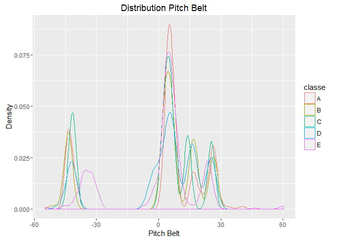

*Synopsis: This documet analyses the training dataset and predicts the
category of the quality of exercise in the test dataset. People commonly
measure the amount of activiteies they perform, but seldom measure how
well they do it. The aim of the current project is to analys the data
from rom accelerometers on the belt, forearm, arm, and dumbell of 6
participants and predict the category of the test data*

Data Preprocessing
------------------

    ##The data for this project come from this source: http://groupware.les.inf.puc-rio.br/har

    #Create sub directory in current working directory if it doesn't exist
    if(!file.exists("./data")){dir.create("./data")}
    trainingFileUrl <- "https://d396qusza40orc.cloudfront.net/predmachlearn/pml-training.csv"
    testFileUrl <- "https://d396qusza40orc.cloudfront.net/predmachlearn/pml-testing.csv"

    # Download File if not dowloaded already
    if(!file.exists("./data/devise.csv")){ download.file(trainingFileUrl,destfile="./data/devise.csv") }
    if(!file.exists("./data/test.csv")){ download.file(testFileUrl,destfile="./data/test.csv") }

    # Unzip and store the data files
    #unzip(zipfile="./data/storm.csv.bz2",exdir="./data")
    path_rf <- file.path("./data")

Read the downloaded file

    # Read Files (into Data Frame)test and training
    deviseData  <- read.csv(file.path(path_rf, "devise.csv" ))
    dim(deviseData)

    ## [1] 19622   160

    testData  <- read.csv(file.path(path_rf, "test.csv" ))
    dim(testData)

    ## [1]  20 160

Include libraries

    library(ggplot2); library(gdata) ; library(caret) ; library(randomForest)

    ## gdata: Unable to locate valid perl interpreter
    ## gdata: 
    ## gdata: read.xls() will be unable to read Excel XLS and XLSX files
    ## gdata: unless the 'perl=' argument is used to specify the location
    ## gdata: of a valid perl intrpreter.
    ## gdata: 
    ## gdata: (To avoid display of this message in the future, please
    ## gdata: ensure perl is installed and available on the executable
    ## gdata: search path.)
    ## gdata: Unable to load perl libaries needed by read.xls()
    ## gdata: to support 'XLX' (Excel 97-2004) files.
    ## 
    ## gdata: Unable to load perl libaries needed by read.xls()
    ## gdata: to support 'XLSX' (Excel 2007+) files.
    ## 
    ## gdata: Run the function 'installXLSXsupport()'
    ## gdata: to automatically download and install the perl
    ## gdata: libaries needed to support Excel XLS and XLSX formats.
    ## 
    ## Attaching package: 'gdata'
    ## 
    ## The following object is masked from 'package:stats':
    ## 
    ##     nobs
    ## 
    ## The following object is masked from 'package:utils':
    ## 
    ##     object.size
    ## 
    ## Loading required package: lattice
    ## randomForest 4.6-12
    ## Type rfNews() to see new features/changes/bug fixes.
    ## 
    ## Attaching package: 'randomForest'
    ## 
    ## The following object is masked from 'package:gdata':
    ## 
    ##     combine
    ## 
    ## The following object is masked from 'package:ggplot2':
    ## 
    ##     margin

    set.seed(12345)
    #From the training data create test and training data

    inTrain <- createDataPartition(y=deviseData$classe,p=0.75, list=FALSE)

    deviseTrain <- deviseData [inTrain,]
    deviseTest <- deviseData [-inTrain,]

    summary(deviseTrain)

    ##        X            user_name    raw_timestamp_part_1 raw_timestamp_part_2
    ##  Min.   :    2   adelmo  :2947   Min.   :1.322e+09    Min.   :   294      
    ##  1st Qu.: 4895   carlitos:2337   1st Qu.:1.323e+09    1st Qu.:254682      
    ##  Median : 9810   charles :2617   Median :1.323e+09    Median :500344      
    ##  Mean   : 9806   eurico  :2301   Mean   :1.323e+09    Mean   :502309      
    ##  3rd Qu.:14722   jeremy  :2532   3rd Qu.:1.323e+09    3rd Qu.:752313      
    ##  Max.   :19620   pedro   :1984   Max.   :1.323e+09    Max.   :998801      
    ##                                                                           
    ##           cvtd_timestamp new_window    num_window      roll_belt    
    ##  28/11/2011 14:14:1160   no :14408   Min.   :  1.0   Min.   :-28.9  
    ##  05/12/2011 11:24:1123   yes:  310   1st Qu.:220.0   1st Qu.:  1.1  
    ##  30/11/2011 17:11:1088               Median :422.0   Median :114.0  
    ##  05/12/2011 11:25:1060               Mean   :429.6   Mean   : 64.6  
    ##  02/12/2011 13:34:1037               3rd Qu.:643.8   3rd Qu.:123.0  
    ##  02/12/2011 14:58:1021               Max.   :864.0   Max.   :162.0  
    ##  (Other)         :8229                                              
    ##    pitch_belt          yaw_belt       total_accel_belt kurtosis_roll_belt
    ##  Min.   :-54.9000   Min.   :-180.00   Min.   : 0.00             :14408   
    ##  1st Qu.:  1.7100   1st Qu.: -88.30   1st Qu.: 3.00    #DIV/0!  :    6   
    ##  Median :  5.2700   Median : -12.70   Median :17.00    -1.908453:    2   
    ##  Mean   :  0.2132   Mean   : -10.86   Mean   :11.33    -0.016850:    1   
    ##  3rd Qu.: 14.9000   3rd Qu.:  13.60   3rd Qu.:18.00    -0.021024:    1   
    ##  Max.   : 60.3000   Max.   : 179.00   Max.   :29.00    -0.025513:    1   
    ##                                                        (Other)  :  299   
    ##  kurtosis_picth_belt kurtosis_yaw_belt skewness_roll_belt
    ##           :14408            :14408              :14408   
    ##  #DIV/0!  :   23     #DIV/0!:  310     #DIV/0!  :    5   
    ##  47.000000:    4                       0.000000 :    3   
    ##  -1.750749:    3                       0.422463 :    2   
    ##  -1.851307:    3                       -0.003095:    1   
    ##  1.326417 :    3                       -0.015465:    1   
    ##  (Other)  :  274                       (Other)  :  298   
    ##  skewness_roll_belt.1 skewness_yaw_belt max_roll_belt     max_picth_belt 
    ##           :14408             :14408     Min.   :-94.300   Min.   : 3.00  
    ##  #DIV/0!  :   23      #DIV/0!:  310     1st Qu.:-88.000   1st Qu.: 5.00  
    ##  -6.324555:    3                        Median : -4.900   Median :18.00  
    ##  6.855655 :    3                        Mean   : -5.743   Mean   :12.97  
    ##  -0.189082:    2                        3rd Qu.: 20.075   3rd Qu.:19.00  
    ##  -0.475418:    2                        Max.   :180.000   Max.   :30.00  
    ##  (Other)  :  277                        NA's   :14408     NA's   :14408  
    ##   max_yaw_belt   min_roll_belt     min_pitch_belt   min_yaw_belt  
    ##         :14408   Min.   :-180.00   Min.   : 0.00          :14408  
    ##  -1.1   :   22   1st Qu.: -88.47   1st Qu.: 3.00   -1.1   :   22  
    ##  -1.4   :   21   Median :  -8.00   Median :16.00   -1.4   :   21  
    ##  -1.5   :   20   Mean   : -10.20   Mean   :10.72   -1.5   :   20  
    ##  -1.2   :   19   3rd Qu.:  13.28   3rd Qu.:17.00   -1.2   :   19  
    ##  -0.9   :   18   Max.   : 173.00   Max.   :23.00   -0.9   :   18  
    ##  (Other):  210   NA's   :14408     NA's   :14408   (Other):  210  
    ##  amplitude_roll_belt amplitude_pitch_belt amplitude_yaw_belt
    ##  Min.   :  0.000     Min.   : 0.000              :14408     
    ##  1st Qu.:  0.325     1st Qu.: 1.000       #DIV/0!:    6     
    ##  Median :  1.000     Median : 1.000       0.00   :    7     
    ##  Mean   :  4.454     Mean   : 2.258       0.0000 :  297     
    ##  3rd Qu.:  2.197     3rd Qu.: 2.000                         
    ##  Max.   :360.000     Max.   :12.000                         
    ##  NA's   :14408       NA's   :14408                          
    ##  var_total_accel_belt avg_roll_belt    stddev_roll_belt var_roll_belt    
    ##  Min.   : 0.000       Min.   :-27.40   Min.   : 0.000   Min.   :  0.000  
    ##  1st Qu.: 0.100       1st Qu.:  1.10   1st Qu.: 0.200   1st Qu.:  0.000  
    ##  Median : 0.200       Median :116.40   Median : 0.400   Median :  0.100  
    ##  Mean   : 0.983       Mean   : 67.94   Mean   : 1.422   Mean   :  8.342  
    ##  3rd Qu.: 0.300       3rd Qu.:124.00   3rd Qu.: 0.800   3rd Qu.:  0.600  
    ##  Max.   :16.500       Max.   :157.40   Max.   :14.200   Max.   :200.700  
    ##  NA's   :14408        NA's   :14408    NA's   :14408    NA's   :14408    
    ##  avg_pitch_belt    stddev_pitch_belt var_pitch_belt    avg_yaw_belt     
    ##  Min.   :-51.400   Min.   :0.000     Min.   : 0.000   Min.   :-138.300  
    ##  1st Qu.:  1.925   1st Qu.:0.200     1st Qu.: 0.000   1st Qu.: -88.200  
    ##  Median :  5.100   Median :0.400     Median : 0.100   Median :  -6.650  
    ##  Mean   :  0.054   Mean   :0.625     Mean   : 0.828   Mean   :  -8.327  
    ##  3rd Qu.: 14.300   3rd Qu.:0.700     3rd Qu.: 0.585   3rd Qu.:  18.025  
    ##  Max.   : 59.700   Max.   :4.000     Max.   :16.200   Max.   : 173.500  
    ##  NA's   :14408     NA's   :14408     NA's   :14408    NA's   :14408     
    ##  stddev_yaw_belt    var_yaw_belt        gyros_belt_x      
    ##  Min.   :  0.000   Min.   :    0.000   Min.   :-1.040000  
    ##  1st Qu.:  0.100   1st Qu.:    0.010   1st Qu.:-0.030000  
    ##  Median :  0.300   Median :    0.110   Median : 0.030000  
    ##  Mean   :  1.603   Mean   :  140.557   Mean   :-0.006282  
    ##  3rd Qu.:  0.700   3rd Qu.:    0.532   3rd Qu.: 0.110000  
    ##  Max.   :176.600   Max.   :31183.240   Max.   : 2.220000  
    ##  NA's   :14408     NA's   :14408                          
    ##   gyros_belt_y       gyros_belt_z      accel_belt_x      accel_belt_y   
    ##  Min.   :-0.64000   Min.   :-1.3500   Min.   :-82.000   Min.   :-69.00  
    ##  1st Qu.: 0.00000   1st Qu.:-0.2000   1st Qu.:-21.000   1st Qu.:  3.00  
    ##  Median : 0.02000   Median :-0.1000   Median :-15.000   Median : 35.00  
    ##  Mean   : 0.03965   Mean   :-0.1293   Mean   : -5.461   Mean   : 30.19  
    ##  3rd Qu.: 0.11000   3rd Qu.:-0.0200   3rd Qu.: -5.000   3rd Qu.: 61.00  
    ##  Max.   : 0.64000   Max.   : 1.6200   Max.   : 85.000   Max.   :149.00  
    ##                                                                         
    ##   accel_belt_z     magnet_belt_x    magnet_belt_y   magnet_belt_z   
    ##  Min.   :-275.00   Min.   :-43.00   Min.   :354.0   Min.   :-623.0  
    ##  1st Qu.:-162.00   1st Qu.:  9.00   1st Qu.:581.0   1st Qu.:-375.0  
    ##  Median :-153.00   Median : 34.00   Median :601.0   Median :-320.0  
    ##  Mean   : -72.91   Mean   : 55.62   Mean   :593.6   Mean   :-345.9  
    ##  3rd Qu.:  27.00   3rd Qu.: 59.00   3rd Qu.:610.0   3rd Qu.:-306.0  
    ##  Max.   : 105.00   Max.   :481.00   Max.   :673.0   Max.   : 293.0  
    ##                                                                     
    ##     roll_arm         pitch_arm          yaw_arm          total_accel_arm
    ##  Min.   :-180.00   Min.   :-88.800   Min.   :-180.0000   Min.   : 1.00  
    ##  1st Qu.: -31.20   1st Qu.:-26.100   1st Qu.: -43.1000   1st Qu.:17.00  
    ##  Median :   0.00   Median :  0.000   Median :   0.0000   Median :27.00  
    ##  Mean   :  18.09   Mean   : -4.704   Mean   :  -0.9331   Mean   :25.49  
    ##  3rd Qu.:  77.60   3rd Qu.: 11.200   3rd Qu.:  45.3000   3rd Qu.:33.00  
    ##  Max.   : 179.00   Max.   : 88.500   Max.   : 180.0000   Max.   :66.00  
    ##                                                                         
    ##  var_accel_arm      avg_roll_arm     stddev_roll_arm    var_roll_arm      
    ##  Min.   :  0.000   Min.   :-166.67   Min.   :  0.000   Min.   :    0.000  
    ##  1st Qu.:  8.787   1st Qu.: -40.69   1st Qu.:  1.344   1st Qu.:    1.813  
    ##  Median : 40.523   Median :   0.00   Median :  5.569   Median :   31.015  
    ##  Mean   : 53.306   Mean   :  11.78   Mean   : 10.815   Mean   :  351.673  
    ##  3rd Qu.: 75.435   3rd Qu.:  75.13   3rd Qu.: 14.902   3rd Qu.:  222.084  
    ##  Max.   :331.699   Max.   : 163.33   Max.   :161.964   Max.   :26232.208  
    ##  NA's   :14408     NA's   :14408     NA's   :14408     NA's   :14408      
    ##  avg_pitch_arm     stddev_pitch_arm var_pitch_arm       avg_yaw_arm      
    ##  Min.   :-81.773   Min.   : 0.000   Min.   :   0.000   Min.   :-173.440  
    ##  1st Qu.:-21.378   1st Qu.: 1.694   1st Qu.:   2.868   1st Qu.: -30.248  
    ##  Median :  0.000   Median : 8.013   Median :  64.204   Median :   0.000  
    ##  Mean   : -3.648   Mean   :10.356   Mean   : 197.617   Mean   :  -0.062  
    ##  3rd Qu.: 10.996   3rd Qu.:16.011   3rd Qu.: 256.357   3rd Qu.:  33.829  
    ##  Max.   : 75.659   Max.   :43.412   Max.   :1884.565   Max.   : 152.000  
    ##  NA's   :14408     NA's   :14408    NA's   :14408      NA's   :14408     
    ##  stddev_yaw_arm     var_yaw_arm         gyros_arm_x      
    ##  Min.   :  0.000   Min.   :    0.000   Min.   :-6.37000  
    ##  1st Qu.:  2.343   1st Qu.:    5.521   1st Qu.:-1.33000  
    ##  Median : 16.166   Median :  261.348   Median : 0.08000  
    ##  Mean   : 21.835   Mean   : 1013.934   Mean   : 0.04609  
    ##  3rd Qu.: 35.876   3rd Qu.: 1287.098   3rd Qu.: 1.57000  
    ##  Max.   :163.258   Max.   :26653.192   Max.   : 4.87000  
    ##  NA's   :14408     NA's   :14408                         
    ##   gyros_arm_y       gyros_arm_z       accel_arm_x       accel_arm_y     
    ##  Min.   :-3.4000   Min.   :-2.3300   Min.   :-404.00   Min.   :-315.00  
    ##  1st Qu.:-0.8000   1st Qu.:-0.0700   1st Qu.:-240.75   1st Qu.: -54.00  
    ##  Median :-0.2400   Median : 0.2300   Median : -43.00   Median :  13.00  
    ##  Mean   :-0.2592   Mean   : 0.2683   Mean   : -58.85   Mean   :  32.31  
    ##  3rd Qu.: 0.1400   3rd Qu.: 0.7200   3rd Qu.:  84.00   3rd Qu.: 139.00  
    ##  Max.   : 2.8400   Max.   : 3.0200   Max.   : 437.00   Max.   : 299.00  
    ##                                                                         
    ##   accel_arm_z       magnet_arm_x     magnet_arm_y     magnet_arm_z   
    ##  Min.   :-636.00   Min.   :-584.0   Min.   :-392.0   Min.   :-596.0  
    ##  1st Qu.:-143.00   1st Qu.:-299.0   1st Qu.:  -9.0   1st Qu.: 130.0  
    ##  Median : -46.00   Median : 296.0   Median : 200.0   Median : 443.0  
    ##  Mean   : -71.22   Mean   : 194.8   Mean   : 155.8   Mean   : 305.6  
    ##  3rd Qu.:  23.00   3rd Qu.: 638.0   3rd Qu.: 322.0   3rd Qu.: 544.0  
    ##  Max.   : 292.00   Max.   : 782.0   Max.   : 583.0   Max.   : 694.0  
    ##                                                                      
    ##  kurtosis_roll_arm kurtosis_picth_arm kurtosis_yaw_arm skewness_roll_arm
    ##          :14408            :14408             :14408           :14408   
    ##  #DIV/0! :   58    #DIV/0! :   60     #DIV/0! :    9   #DIV/0! :   57   
    ##  -0.02438:    1    -0.00484:    1     -0.01548:    1   -0.00051:    1   
    ##  -0.04190:    1    -0.02967:    1     -0.01749:    1   -0.01884:    1   
    ##  -0.05051:    1    -0.07394:    1     -0.02101:    1   -0.03359:    1   
    ##  -0.08050:    1    -0.10385:    1     -0.04626:    1   -0.03484:    1   
    ##  (Other) :  248    (Other) :  246     (Other) :  297   (Other) :  249   
    ##  skewness_pitch_arm skewness_yaw_arm  max_roll_arm     max_picth_arm    
    ##          :14408             :14408   Min.   :-73.100   Min.   :-173.00  
    ##  #DIV/0! :   60     #DIV/0! :    9   1st Qu.: -0.075   1st Qu.:  -3.70  
    ##  -0.00184:    1     -0.00311:    1   Median :  5.150   Median :  22.30  
    ##  -0.01185:    1     -0.00562:    1   Mean   : 12.325   Mean   :  33.18  
    ##  -0.01247:    1     -0.00800:    1   3rd Qu.: 27.500   3rd Qu.:  94.17  
    ##  -0.02063:    1     -0.01697:    1   Max.   : 85.500   Max.   : 180.00  
    ##  (Other) :  246     (Other) :  297   NA's   :14408     NA's   :14408    
    ##   max_yaw_arm     min_roll_arm    min_pitch_arm      min_yaw_arm   
    ##  Min.   : 4.0    Min.   :-88.80   Min.   :-180.00   Min.   : 1.00  
    ##  1st Qu.:29.0    1st Qu.:-41.40   1st Qu.: -73.28   1st Qu.: 8.00  
    ##  Median :34.0    Median :-22.45   Median : -33.90   Median :13.00  
    ##  Mean   :35.5    Mean   :-20.28   Mean   : -35.96   Mean   :14.58  
    ##  3rd Qu.:42.0    3rd Qu.:  0.00   3rd Qu.:   0.00   3rd Qu.:19.00  
    ##  Max.   :62.0    Max.   : 66.40   Max.   : 152.00   Max.   :38.00  
    ##  NA's   :14408   NA's   :14408    NA's   :14408     NA's   :14408  
    ##  amplitude_roll_arm amplitude_pitch_arm amplitude_yaw_arm
    ##  Min.   :  0.000    Min.   :  0.000     Min.   : 0.00    
    ##  1st Qu.:  5.275    1st Qu.:  9.825     1st Qu.:12.25    
    ##  Median : 28.355    Median : 53.950     Median :22.00    
    ##  Mean   : 32.606    Mean   : 69.141     Mean   :20.92    
    ##  3rd Qu.: 50.805    3rd Qu.:117.350     3rd Qu.:29.00    
    ##  Max.   :119.500    Max.   :359.000     Max.   :52.00    
    ##  NA's   :14408      NA's   :14408       NA's   :14408    
    ##  roll_dumbbell     pitch_dumbbell     yaw_dumbbell     
    ##  Min.   :-152.83   Min.   :-149.59   Min.   :-150.871  
    ##  1st Qu.: -17.93   1st Qu.: -40.39   1st Qu.: -77.786  
    ##  Median :  47.91   Median : -21.04   Median :  -3.897  
    ##  Mean   :  23.91   Mean   : -10.69   Mean   :   1.383  
    ##  3rd Qu.:  67.64   3rd Qu.:  17.57   3rd Qu.:  79.291  
    ##  Max.   : 153.55   Max.   : 149.40   Max.   : 154.952  
    ##                                                        
    ##  kurtosis_roll_dumbbell kurtosis_picth_dumbbell kurtosis_yaw_dumbbell
    ##         :14408                 :14408                  :14408        
    ##  #DIV/0!:    4          -0.9334:    2           #DIV/0!:  310        
    ##  -0.2583:    2          #DIV/0!:    2                                
    ##  -0.0035:    1          -0.0163:    1                                
    ##  -0.0073:    1          -0.0233:    1                                
    ##  -0.0262:    1          -0.0308:    1                                
    ##  (Other):  301          (Other):  303                                
    ##  skewness_roll_dumbbell skewness_pitch_dumbbell skewness_yaw_dumbbell
    ##         :14408                 :14408                  :14408        
    ##  #DIV/0!:    3          -0.2328:    2           #DIV/0!:  310        
    ##  -0.9324:    2          -0.7036:    2                                
    ##  0.1110 :    2          0.1090 :    2                                
    ##  -0.0234:    1          -0.0166:    1                                
    ##  -0.0393:    1          -0.0452:    1                                
    ##  (Other):  301          (Other):  302                                
    ##  max_roll_dumbbell max_picth_dumbbell max_yaw_dumbbell min_roll_dumbbell
    ##  Min.   :-70.10    Min.   :-112.90           :14408    Min.   :-134.90  
    ##  1st Qu.:-27.27    1st Qu.: -66.25    -0.8   :   15    1st Qu.: -60.35  
    ##  Median : 14.05    Median :  36.00    -0.5   :   13    Median : -42.60  
    ##  Mean   : 13.19    Mean   :  32.27    -0.6   :   13    Mean   : -41.35  
    ##  3rd Qu.: 50.58    3rd Qu.: 132.88    0.2    :   13    3rd Qu.: -25.65  
    ##  Max.   :137.00    Max.   : 154.80    -0.2   :   12    Max.   :  73.20  
    ##  NA's   :14408     NA's   :14408      (Other):  244    NA's   :14408    
    ##  min_pitch_dumbbell min_yaw_dumbbell amplitude_roll_dumbbell
    ##  Min.   :-147.00           :14408    Min.   :  0.00         
    ##  1st Qu.: -90.60    -0.8   :   15    1st Qu.: 15.56         
    ##  Median : -67.15    -0.5   :   13    Median : 33.30         
    ##  Mean   : -34.17    -0.6   :   13    Mean   : 54.55         
    ##  3rd Qu.:  20.02    0.2    :   13    3rd Qu.: 77.56         
    ##  Max.   : 120.90    -0.2   :   12    Max.   :256.48         
    ##  NA's   :14408      (Other):  244    NA's   :14408          
    ##  amplitude_pitch_dumbbell amplitude_yaw_dumbbell total_accel_dumbbell
    ##  Min.   :  0.00                  :14408          Min.   : 0.00       
    ##  1st Qu.: 17.70           #DIV/0!:    4          1st Qu.: 4.00       
    ##  Median : 41.52           0.00   :  306          Median :10.00       
    ##  Mean   : 66.44                                  Mean   :13.73       
    ##  3rd Qu.: 97.95                                  3rd Qu.:19.00       
    ##  Max.   :273.59                                  Max.   :58.00       
    ##  NA's   :14408                                                       
    ##  var_accel_dumbbell avg_roll_dumbbell stddev_roll_dumbbell
    ##  Min.   :  0.000    Min.   :-128.96   Min.   :  0.000     
    ##  1st Qu.:  0.377    1st Qu.: -12.46   1st Qu.:  4.668     
    ##  Median :  1.071    Median :  49.09   Median : 11.866     
    ##  Mean   :  4.728    Mean   :  24.12   Mean   : 20.546     
    ##  3rd Qu.:  3.491    3rd Qu.:  62.88   3rd Qu.: 26.270     
    ##  Max.   :230.428    Max.   : 125.99   Max.   :113.657     
    ##  NA's   :14408      NA's   :14408     NA's   :14408       
    ##  var_roll_dumbbell  avg_pitch_dumbbell stddev_pitch_dumbbell
    ##  Min.   :    0.00   Min.   :-70.73     Min.   : 0.000       
    ##  1st Qu.:   21.79   1st Qu.:-42.41     1st Qu.: 3.597       
    ##  Median :  140.80   Median :-20.20     Median : 7.899       
    ##  Mean   : 1002.95   Mean   :-12.65     Mean   :13.030       
    ##  3rd Qu.:  690.12   3rd Qu.: 11.86     3rd Qu.:19.316       
    ##  Max.   :12917.90   Max.   : 94.28     Max.   :82.680       
    ##  NA's   :14408      NA's   :14408      NA's   :14408        
    ##  var_pitch_dumbbell avg_yaw_dumbbell   stddev_yaw_dumbbell
    ##  Min.   :   0.00    Min.   :-117.950   Min.   :  0.000    
    ##  1st Qu.:  12.94    1st Qu.: -77.071   1st Qu.:  4.195    
    ##  Median :  62.39    Median :  -1.508   Median : 10.066    
    ##  Mean   : 342.41    Mean   :  -1.079   Mean   : 16.695    
    ##  3rd Qu.: 373.11    3rd Qu.:  70.833   3rd Qu.: 25.180    
    ##  Max.   :6836.02    Max.   : 134.905   Max.   :107.088    
    ##  NA's   :14408      NA's   :14408      NA's   :14408      
    ##  var_yaw_dumbbell  gyros_dumbbell_x    gyros_dumbbell_y  
    ##  Min.   :    0.0   Min.   :-204.0000   Min.   :-2.10000  
    ##  1st Qu.:   17.6   1st Qu.:  -0.0300   1st Qu.:-0.14000  
    ##  Median :  101.4   Median :   0.1400   Median : 0.03000  
    ##  Mean   :  597.0   Mean   :   0.1598   Mean   : 0.04359  
    ##  3rd Qu.:  634.0   3rd Qu.:   0.3700   3rd Qu.: 0.21000  
    ##  Max.   :11467.9   Max.   :   2.2200   Max.   :52.00000  
    ##  NA's   :14408                                           
    ##  gyros_dumbbell_z   accel_dumbbell_x  accel_dumbbell_y  accel_dumbbell_z 
    ##  Min.   : -2.3000   Min.   :-419.00   Min.   :-189.00   Min.   :-334.00  
    ##  1st Qu.: -0.3100   1st Qu.: -51.00   1st Qu.:  -8.00   1st Qu.:-142.00  
    ##  Median : -0.1300   Median :  -8.00   Median :  41.00   Median :  -1.00  
    ##  Mean   : -0.1236   Mean   : -28.43   Mean   :  52.54   Mean   : -38.56  
    ##  3rd Qu.:  0.0300   3rd Qu.:  11.00   3rd Qu.: 110.00   3rd Qu.:  38.00  
    ##  Max.   :317.0000   Max.   : 235.00   Max.   : 315.00   Max.   : 318.00  
    ##                                                                          
    ##  magnet_dumbbell_x magnet_dumbbell_y magnet_dumbbell_z  roll_forearm      
    ##  Min.   :-643.0    Min.   :-3600     Min.   :-262.0    Min.   :-180.0000  
    ##  1st Qu.:-535.0    1st Qu.:  231     1st Qu.: -46.0    1st Qu.:  -0.7075  
    ##  Median :-480.0    Median :  310     Median :  14.0    Median :  21.4000  
    ##  Mean   :-326.8    Mean   :  219     Mean   :  45.9    Mean   :  33.6990  
    ##  3rd Qu.:-301.0    3rd Qu.:  390     3rd Qu.:  95.0    3rd Qu.: 140.0000  
    ##  Max.   : 592.0    Max.   :  633     Max.   : 452.0    Max.   : 180.0000  
    ##                                                                           
    ##  pitch_forearm      yaw_forearm      kurtosis_roll_forearm
    ##  Min.   :-72.500   Min.   :-180.00          :14408        
    ##  1st Qu.:  0.000   1st Qu.: -67.28   #DIV/0!:   67        
    ##  Median :  9.195   Median :   0.00   -0.8079:    2        
    ##  Mean   : 10.788   Mean   :  19.96   -0.0227:    1        
    ##  3rd Qu.: 28.400   3rd Qu.: 110.00   -0.0359:    1        
    ##  Max.   : 88.700   Max.   : 180.00   -0.0567:    1        
    ##                                      (Other):  238        
    ##  kurtosis_picth_forearm kurtosis_yaw_forearm skewness_roll_forearm
    ##         :14408                 :14408               :14408        
    ##  #DIV/0!:   68          #DIV/0!:  310        #DIV/0!:   66        
    ##  -0.0073:    1                               -0.1912:    2        
    ##  -0.0442:    1                               -0.0013:    1        
    ##  -0.0489:    1                               -0.0063:    1        
    ##  -0.0523:    1                               -0.0088:    1        
    ##  (Other):  238                               (Other):  239        
    ##  skewness_pitch_forearm skewness_yaw_forearm max_roll_forearm
    ##         :14408                 :14408        Min.   :-66.60  
    ##  #DIV/0!:   68          #DIV/0!:  310        1st Qu.:  0.00  
    ##  0.0000 :    3                               Median : 26.00  
    ##  -0.6992:    2                               Mean   : 23.78  
    ##  -0.0131:    1                               3rd Qu.: 44.88  
    ##  -0.0405:    1                               Max.   : 89.80  
    ##  (Other):  235                               NA's   :14408   
    ##  max_picth_forearm max_yaw_forearm min_roll_forearm  min_pitch_forearm
    ##  Min.   :-151.00          :14408   Min.   :-72.500   Min.   :-180.00  
    ##  1st Qu.:   0.00   #DIV/0!:   67   1st Qu.: -5.750   1st Qu.:-174.00  
    ##  Median : 111.00   -1.3   :   28   Median :  0.000   Median : -47.35  
    ##  Mean   :  82.42   -1.2   :   25   Mean   : -0.381   Mean   : -54.37  
    ##  3rd Qu.: 174.00   -1.4   :   20   3rd Qu.: 11.250   3rd Qu.:   0.00  
    ##  Max.   : 180.00   -1.5   :   17   Max.   : 62.100   Max.   : 167.00  
    ##  NA's   :14408     (Other):  153   NA's   :14408     NA's   :14408    
    ##  min_yaw_forearm amplitude_roll_forearm amplitude_pitch_forearm
    ##         :14408   Min.   :  0.000        Min.   :  0.00         
    ##  #DIV/0!:   67   1st Qu.:  0.925        1st Qu.:  1.85         
    ##  -1.3   :   28   Median : 17.185        Median : 81.50         
    ##  -1.2   :   25   Mean   : 24.162        Mean   :136.79         
    ##  -1.4   :   20   3rd Qu.: 39.263        3rd Qu.:350.00         
    ##  -1.5   :   17   Max.   :126.000        Max.   :360.00         
    ##  (Other):  153   NA's   :14408          NA's   :14408          
    ##  amplitude_yaw_forearm total_accel_forearm var_accel_forearm
    ##         :14408         Min.   :  0.00      Min.   :  0.000  
    ##  #DIV/0!:   67         1st Qu.: 29.00      1st Qu.:  5.532  
    ##  0.00   :  243         Median : 36.00      Median : 22.011  
    ##                        Mean   : 34.78      Mean   : 33.050  
    ##                        3rd Qu.: 41.00      3rd Qu.: 52.854  
    ##                        Max.   :108.00      Max.   :172.606  
    ##                                            NA's   :14408    
    ##  avg_roll_forearm  stddev_roll_forearm var_roll_forearm  
    ##  Min.   :-177.23   Min.   :  0.000     Min.   :    0.00  
    ##  1st Qu.:   0.00   1st Qu.:  0.348     1st Qu.:    0.12  
    ##  Median :  14.18   Median :  6.383     Median :   40.75  
    ##  Mean   :  35.67   Mean   : 43.093     Mean   : 5505.31  
    ##  3rd Qu.: 111.71   3rd Qu.: 89.390     3rd Qu.: 7992.27  
    ##  Max.   : 177.26   Max.   :179.171     Max.   :32102.24  
    ##  NA's   :14408     NA's   :14408       NA's   :14408     
    ##  avg_pitch_forearm stddev_pitch_forearm var_pitch_forearm 
    ##  Min.   :-68.17    Min.   : 0.000       Min.   :   0.000  
    ##  1st Qu.:  0.00    1st Qu.: 0.298       1st Qu.:   0.089  
    ##  Median : 11.86    Median : 5.406       Median :  29.220  
    ##  Mean   : 11.46    Mean   : 7.842       Mean   : 138.467  
    ##  3rd Qu.: 26.46    3rd Qu.:12.801       3rd Qu.: 163.875  
    ##  Max.   : 72.09    Max.   :47.745       Max.   :2279.617  
    ##  NA's   :14408     NA's   :14408        NA's   :14408     
    ##  avg_yaw_forearm   stddev_yaw_forearm var_yaw_forearm   
    ##  Min.   :-151.45   Min.   :  0.000    Min.   :    0.00  
    ##  1st Qu.: -24.78   1st Qu.:  0.509    1st Qu.:    0.26  
    ##  Median :   0.00   Median : 23.700    Median :  562.17  
    ##  Mean   :  19.25   Mean   : 44.262    Mean   : 4608.51  
    ##  3rd Qu.:  85.79   3rd Qu.: 82.272    3rd Qu.: 6768.75  
    ##  Max.   : 169.24   Max.   :197.508    Max.   :39009.33  
    ##  NA's   :14408     NA's   :14408      NA's   :14408     
    ##  gyros_forearm_x    gyros_forearm_y     gyros_forearm_z   
    ##  Min.   :-22.0000   Min.   : -6.65000   Min.   : -7.9400  
    ##  1st Qu.: -0.2200   1st Qu.: -1.46000   1st Qu.: -0.1800  
    ##  Median :  0.0500   Median :  0.03000   Median :  0.0800  
    ##  Mean   :  0.1582   Mean   :  0.08662   Mean   :  0.1561  
    ##  3rd Qu.:  0.5800   3rd Qu.:  1.62000   3rd Qu.:  0.4900  
    ##  Max.   :  3.9700   Max.   :311.00000   Max.   :231.0000  
    ##                                                           
    ##  accel_forearm_x   accel_forearm_y  accel_forearm_z   magnet_forearm_x 
    ##  Min.   :-498.00   Min.   :-632.0   Min.   :-391.00   Min.   :-1280.0  
    ##  1st Qu.:-179.00   1st Qu.:  59.0   1st Qu.:-181.00   1st Qu.: -617.0  
    ##  Median : -57.00   Median : 201.0   Median : -40.00   Median : -383.0  
    ##  Mean   : -62.43   Mean   : 164.2   Mean   : -55.13   Mean   : -315.4  
    ##  3rd Qu.:  76.00   3rd Qu.: 313.0   3rd Qu.:  26.00   3rd Qu.:  -78.0  
    ##  Max.   : 477.00   Max.   : 923.0   Max.   : 291.00   Max.   :  672.0  
    ##                                                                        
    ##  magnet_forearm_y    magnet_forearm_z classe  
    ##  Min.   :-892.0000   Min.   :-973.0   A:4185  
    ##  1st Qu.:  -0.0922   1st Qu.: 191.0   B:2848  
    ##  Median : 589.0000   Median : 512.0   C:2567  
    ##  Mean   : 381.0351   Mean   : 393.9   D:2412  
    ##  3rd Qu.: 737.0000   3rd Qu.: 653.0   E:2706  
    ##  Max.   :1480.0000   Max.   :1090.0           
    ## 

    # Plot graph to visually look at some key variables 
    qplot(pitch_forearm , data=deviseTrain, geom="density", colour=classe, 
       main="Distribution Pitch Forearm", xlab="Pitch Forearm", 
       ylab="Density")

    # Plot graph to visually look at some key variables 
    qplot(pitch_arm , data=deviseTrain, geom="density", colour=classe, 
       main="Distribution Pitch Arm", xlab="Pitch Arm", 
       ylab="Density")

    # Plot graph to visually look at some key variables 
    qplot(pitch_belt , data=deviseTrain, geom="density", colour=classe, 
       main="Distribution Pitch Belt", xlab="Pitch Belt", 
       ylab="Density")

Results:
========

Fit the model in test Data and calculate the training data

    #From the summary of the training data it is ovserved that first sevel columns are accessory data and not related to the activity output
    #Also many of the data elements have a large number (14,408) of invalid data. all these are removed from the 
    #Select the names of feature variables.

    predCol <- matchcols(deviseTrain[,-(1:7)], without=c
                          ("skewness","kurtosis","max","min", "amplitude", "var_","stddev_","avg_", 
                          "classe"), method="or")

    #Create the dataframe with 
    predVars <- deviseTrain[,predCol]

    #create the model with Random Forest 
    modFit <- randomForest(x= predVars,y= deviseTrain$classe)

    modFit

    ## 
    ## Call:
    ##  randomForest(x = predVars, y = deviseTrain$classe) 
    ##                Type of random forest: classification
    ##                      Number of trees: 500
    ## No. of variables tried at each split: 7
    ## 
    ##         OOB estimate of  error rate: 0.4%
    ## Confusion matrix:
    ##      A    B    C    D    E  class.error
    ## A 4184    1    0    0    0 0.0002389486
    ## B    8 2838    2    0    0 0.0035112360
    ## C    0   13 2553    1    0 0.0054538372
    ## D    0    0   21 2388    3 0.0099502488
    ## E    0    0    1    9 2696 0.0036954915

    # Apply the model on the test data separated out of training data
    test <- deviseTest[,predCol]
    pred <- predict(modFit,test)

    table(pred,deviseTest$classe)

    ##     
    ## pred    A    B    C    D    E
    ##    A 1395    6    0    0    0
    ##    B    0  939    3    0    0
    ##    C    0    4  850    7    1
    ##    D    0    0    2  797    4
    ##    E    0    0    0    0  896

**Conclusion: **

*Random Forest has been used because of inherent accuracy of the model*

    # Fitting the model on the supplied test Data  
    testFinal <- testData[,predCol]
    pred <- predict(modFit,testFinal)
    pred

    ##  1  2  3  4  5  6  7  8  9 10 11 12 13 14 15 16 17 18 19 20 
    ##  B  A  B  A  A  E  D  B  A  A  B  C  B  A  E  E  A  B  B  B 
    ## Levels: A B C D E
